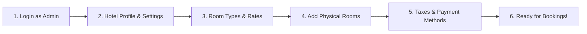
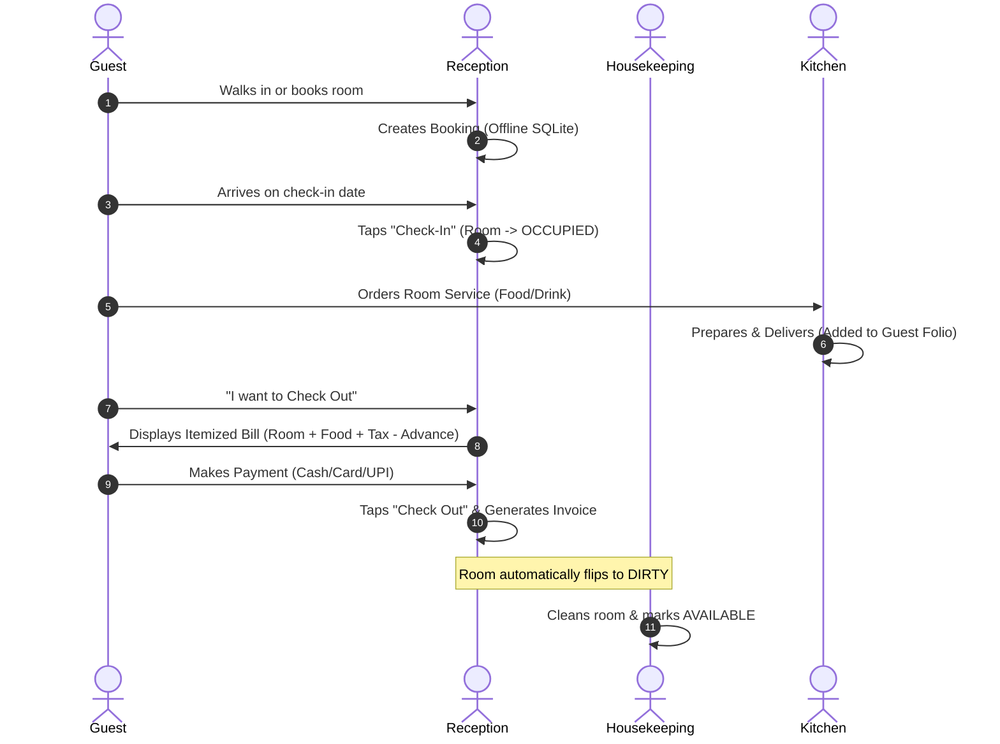

# 🚀 Hotel Management App — Complete Setup & Operations Guide
## From App Creation to Daily Hotel Operations (Step-by-Step)

This guide walks you through the entire process **from the very beginning** (fresh project setup) to **day-to-day hotel operations**, ensuring you know exactly what to do at every stage.

---

## 📑 Table of Contents
1. [Phase 1: Initial Prerequisites & Installation](#phase-1-initial-prerequisites--installation)
2. [Phase 2: Launching the Backend (Auto Database & Table Creation)](#phase-2-launching-the-backend-auto-database--table-creation)
3. [Phase 3: Launching the Flutter App](#phase-3-launching-the-flutter-app)
4. [Phase 4: First-Time Setup in the App (Admin Configuration)](#phase-4-first-time-setup-in-the-app-admin-configuration)
5. [Phase 5: Staff Accounts & Role Assignment](#phase-5-staff-accounts--role-assignment)
6. [Phase 6: Daily Hotel Operations (Reception & Staff Workflow)](#phase-6-daily-hotel-operations-reception--staff-workflow)
7. [Phase 7: Multi-Device Networking & Offline Sync](#phase-7-multi-device-networking--offline-sync)
8. [Phase 8: Database Backups & Maintenance](#phase-8-database-backups--maintenance)

---

## Phase 1: Initial Prerequisites & Installation

Before running the system, make sure the following are installed on your host machine:

| Software | Minimum Version | Purpose |
| :--- | :--- | :--- |
| **Node.js** | v18+ | Runs the backend API server |
| **MySQL / MariaDB** | 8.0+ / 10.6+ | Central relational database |
| **Flutter SDK** *(Optional for dev)* | 3.19+ | If building/modifying the frontend code |

---

## Phase 2: Launching the Backend (Auto Database & Table Creation)

The backend is configured to **automatically create the database and all 20 tables** when started.

### Step 1: Configure Environment Variables
1. Open your terminal and navigate to the backend directory:
   ```bash
   cd hotel-management-app/hotel-backend
   ```
2. Create a `.env` file by copying the example:
   ```bash
   cp .env.example .env
   ```
3. Open `.env` and verify your MySQL credentials:
   ```env
   PORT=5000
   NODE_ENV=development

   # MySQL settings
   DB_HOST=localhost
   DB_PORT=3306
   DB_USER=root
   DB_PASSWORD=your_mysql_password
   DB_NAME=hotel_db

   # Auth secrets (generate any random string for security)
   JWT_SECRET=your_jwt_secret_key_here
   JWT_REFRESH_SECRET=your_refresh_secret_key_here
   ```

### Step 2: Start the Backend
Install dependencies and start the server:
```bash
npm install
npm start
```
*(Or run `npm run dev` if you want automatic restarts during development).*

### 🔍 What Happens Automatically:
- Connects to your MySQL server.
- Creates the `hotel_db` database if it does not already exist.
- Applies all 20 migration files (creates tables: `rooms`, `guests`, `bookings`, `invoices`, `payments`, `food_orders`, etc.).
- Applies seed data (creates default roles, default admin user, amenities, service types).
- Starts listening on **`http://localhost:5000`**.

---

## Phase 3: Launching the Flutter App

You have two ways to run the frontend application:

### Option A: Run the Pre-Built Windows Release (Quickest)
A ready-to-run Windows executable has already been compiled:
- Navigate to:
  ```
  hotel-management-app/hotel_app/build/windows/x64/runner/Release/
  ```
- Double-click **`hotel_app.exe`**.

### Option B: Run in Development Mode via Flutter
If you want to run from source or specify a custom backend IP:
```bash
cd hotel-management-app/hotel_app
flutter pub get
flutter run -d windows --dart-define=API_BASE_URL=http://localhost:5000/api
```

---

## Phase 4: First-Time Setup in the App (Admin Configuration)

Once the application opens, follow this setup sequence:



### 1. Initial Login
Log in using the seeded default administrator account:
- **Username**: `admin`
- **Password**: `admin123`
*(Recommended: Change this password under User Management after first login).*

### 2. Hotel Settings & Branding
Navigate to **Settings** $\rightarrow$ **Hotel Settings**:
- **Hotel Name**: (e.g., *Grand Horizon Hotel*)
- **Address & Contact Info**: Phone number, email, website.
- **Tax / GST Number**: Enter your business tax registration number.
- **Invoice Prefix**: (e.g., `INV-` or `GHH-2026-`).
- **Currency Symbol**: (e.g., `$`, `₹`, `€`).
- **Check-in / Check-out Times**: (e.g., Check-in: `12:00 PM`, Check-out: `11:00 AM`).

### 3. Room Types & Pricing
Navigate to **Settings** $\rightarrow$ **Room Types**:
- Define the categories of rooms you offer (e.g., *Standard Single*, *Deluxe Double*, *Executive Suite*).
- Set the base price per night for each type.
- Set adult and child occupancy capacities.

### 4. Add Physical Rooms
Navigate to **Rooms** $\rightarrow$ **Add Room**:
- Enter Room Number / Name (e.g., `101`, `102`, `201`, `PH-1`).
- Assign its **Room Type**.
- Set its initial status to **`AVAILABLE`**.

### 5. Taxes & Payment Methods
- **Taxes**: Navigate to **Settings** $\rightarrow$ **Taxes** to configure applicable tax rules (e.g., *GST 12%*, *Luxury Tax 5%*).
- **Payment Methods**: Enable the payment types accepted at your desk (e.g., *Cash*, *Credit Card*, *Debit Card*, *UPI / QR*).

---

## Phase 5: Staff Accounts & Role Assignment

To ensure security, create individual accounts for staff members instead of sharing the admin login:

Navigate to **Settings** $\rightarrow$ **Users & Roles**:

| Role | Permissions & Responsibilities |
| :--- | :--- |
| **Admin** | Full access to settings, reports, pricing, staff management, and system logs. |
| **Manager** | Can view reports, manage bookings, oversee billing, handle overrides, and manage rooms. |
| **Receptionist** | Can create bookings, check-in/out guests, add food/service charges, and collect payments. |
| **Housekeeping** | Can view assigned rooms, update cleaning statuses (`DIRTY` $\rightarrow$ `CLEANING` $\rightarrow$ `AVAILABLE`). |
| **Kitchen Staff** | Can view incoming food orders and update cooking/delivery status (`PREPARING` $\rightarrow$ `DELIVERED`). |

---

## Phase 6: Daily Hotel Operations (Reception & Staff Workflow)

Here is what happens during a regular business day:



1. **Morning Shift Handover**:
   - Reception reviews the dashboard: Expected Check-ins, Expected Check-outs, and Current Occupancy.
2. **Guest Check-In**:
   - Verify guest ID, collect advance deposit, and hand over keys.
   - Tap **Check In** in the app.
3. **During the Day**:
   - Post any room service requests or food orders directly to the room.
   - Housekeeping updates cleaned rooms to `AVAILABLE`.
4. **Guest Check-Out**:
   - Generate the final itemized bill.
   - Record payment and mark the booking **Checked Out**.
   - The room automatically transitions to **`DIRTY`** for cleaning.

---

## Phase 7: Multi-Device Networking & Offline Sync

### How to Connect Multiple Devices (Laptops, Tablets, Phones):
1. Make sure all devices are connected to the same local Wi-Fi network.
2. Find the IP address of the computer running the backend (e.g., `192.168.1.50`).
3. Run or configure the Flutter app on other devices pointing to that IP:
   ```bash
   --dart-define=API_BASE_URL=http://192.168.1.50:5000/api
   ```

### Working Offline & Syncing:
- **No Internet Needed for Daily Work**: If the Wi-Fi connection is lost or unstable, staff can continue creating bookings, taking orders, and checking out guests without interruption.
- **Syncing Changes**: When the connection is restored, the **Sync Badge** (top-right corner) will show the count of pending items. Tap **Sync Now** to push all records to the MySQL backend and pull updates from other devices.

---

## Phase 8: Database Backups & Maintenance

To ensure hotel data is always protected:

### 1. Automated / Manual MySQL Backup
Run this command periodically or schedule it daily via Windows Task Scheduler / Cron:
```bash
mysqldump -u root -p hotel_db > hotel_db_backup_$(date +%F).sql
```

### 2. Restoring from Backup (If Needed)
```bash
mysql -u root -p hotel_db < hotel_db_backup_file.sql
```

### 3. Daily Reports Snapshot
The backend includes a pre-built daily reporting module in `src/jobs/dailyReportJob.js` that can be triggered or scheduled to record daily revenue and occupancy snapshots automatically.

---

## 📞 Summary Checklist

- [x] Backend running on port `5000` (`npm start`).
- [x] Database `hotel_db` and all 20 tables created automatically.
- [x] Flutter app running (`hotel_app.exe` or `flutter run`).
- [x] Logged in with `admin` / `admin123`.
- [x] Hotel details, Room types, and Rooms configured.
- [x] Staff accounts created with appropriate roles.
- [x] System ready for seamless guest check-ins and check-outs!
