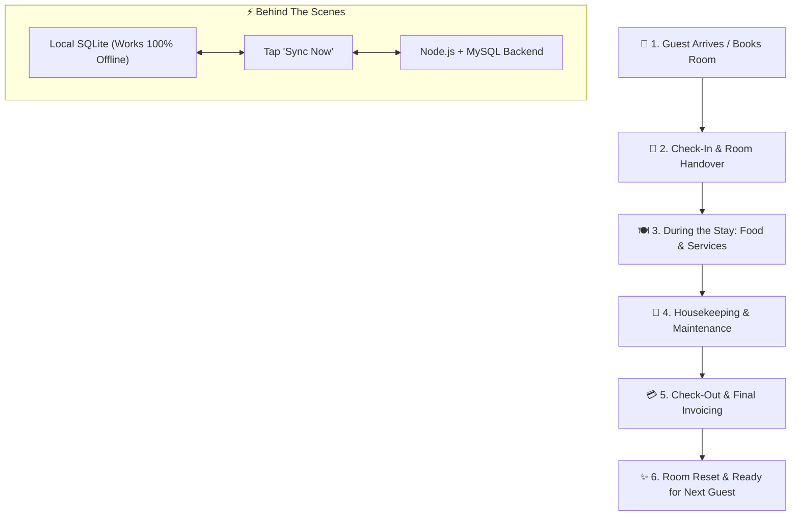
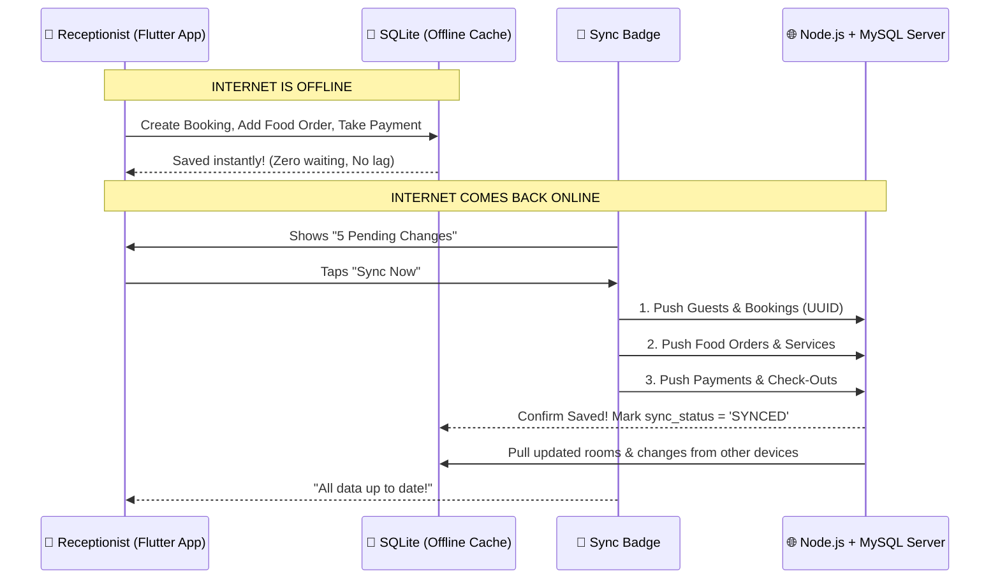
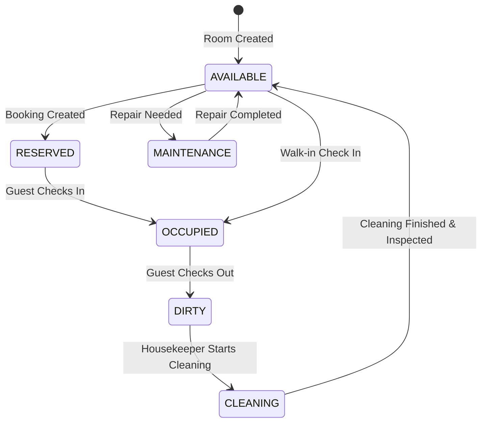

# 🏨 Hotel Management System — Complete Application Workflow

Welcome to the **Hotel Management App**! This guide explains **how the app actually works in simple, easy-to-understand terms** — following a customer from the moment they walk into the hotel until they check out, as well as what happens behind the scenes in the software.

---

## 🗺️ High-Level Customer Journey at a Glance

---

## 1. 👤 Step 1: Guest Arrives or Books a Room

### What the Customer Experiences:
A guest arrives at the hotel reception (walk-in) or calls ahead to make a reservation. They share:
- Their personal details: Name, Mobile Number, Email, and ID Proof (Passport, Driving License, Aadhaar, etc.).
- Their stay dates: Check-in date and expected Check-out date.
- Their preference: Single, Double, Deluxe, or Suite.

### What the Receptionist Does in the App:
1. Opens the **Guests** screen and adds the guest's profile (or selects them if they stayed before).
2. Opens the **Rooms** / **Bookings** screen.
3. Views available rooms matching the dates and guest capacity.
4. Selects an available room (e.g., Room 204 - Deluxe King).
5. Enters any advance deposit paid by the guest.
6. Taps **Create Booking**.

### ⚙️ What Happens Behind the Scenes:
- The app saves the Guest and Booking immediately into the local **SQLite database** on the receptionist's device.
- The record is assigned a unique tracking ID (`UUID`) and tagged as `sync_status = 'PENDING'`.
- The room status is reserved so no other staff member can double-book it.
- **Works even if the Wi-Fi or Internet is completely down!**

---

## 2. 🔑 Step 2: Check-In & Room Handover

### What the Customer Experiences:
- The customer arrives on their check-in day.
- Reception confirms their booking, hands over the room key cards, and welcomes them.

### What the Receptionist Does in the App:
1. Finds the booking under **Active Bookings**.
2. Taps **Check In**.

### ⚙️ What Happens Behind the Scenes:
- The booking status changes to `CHECKED_IN`.
- The room status automatically flips from `AVAILABLE` to `OCCUPIED`.
- If the customer wants to change their room during their stay (e.g. upgrade to Suite), the receptionist can tap **Change Room**, which frees up the old room and marks the new room as occupied.

---

## 3. 🍽️ Step 3: During the Stay (Food Orders & Room Services)

### What the Customer Experiences:
During their stay, the guest can request extra amenities or order food to their room:
- **Food Orders**: The guest calls reception or room service to order breakfast, snacks, coffee, or dinner.
- **Service Requests**: The guest requests laundry, extra towels, iron box, or room cleaning.

### What Staff Does in the App:
1. **Food Orders Screen**:
   - Receptionist/Kitchen staff opens **Food Orders** -> **New Order**.
   - Selects the customer's room number.
   - Picks food items, quantities, and special notes (e.g., "Extra spicy", "No sugar").
   - Kitchen updates the order status: `PENDING` -> `PREPARING` -> `DELIVERED`.
2. **Room Services Screen**:
   - Staff records service requests (e.g., "Dry Cleaning", "Extra Blanket").
   - Assigns cost (if billable) or marks as complimentary.
   - Updates status: `REQUESTED` -> `IN_PROGRESS` -> `COMPLETED`.

### ⚙️ What Happens Behind the Scenes:
- All food items and services are automatically linked to the guest's active booking (`booking_id`).
- The system automatically updates the **Running Bill (Folio)**. The guest does not have to pay cash immediately every time; everything accumulates safely on their hotel account.

---

## 4. 🧹 Step 4: Housekeeping & Maintenance

### What Happens in the Hotel:
- Guests request room cleaning, or daily scheduled cleanings take place.
- If something breaks (e.g., air conditioner not cooling, bathroom tap leaking), it must be fixed quickly.

### What Staff Does in the App:
1. **Housekeeping Screen**:
   - Housekeeping staff views rooms needing cleaning (`DIRTY`).
   - Once cleaned and inspected, staff changes room status: `DIRTY` -> `CLEANING` -> `AVAILABLE`.
2. **Maintenance Screen**:
   - Any staff member can log a maintenance issue: Room number, Issue description, and Priority (`LOW`, `MEDIUM`, `HIGH`, `URGENT`).
   - The room can be temporarily set to `MAINTENANCE` status so reception doesn't accidentally assign it to a new guest.
   - Once resolved, the technician marks it `RESOLVED` and the room returns to service.

---

## 5. 💳 Step 5: Check-Out & Final Invoicing

### What the Customer Experiences:
1. The guest approaches reception to check out.
2. They ask for the final bill.
3. They review their charges:
   - Room rent for the duration of stay
   - Food & beverage orders
   - Special services
   - Taxes (GST / VAT)
   - Minus any advance deposit paid at booking
4. The guest pays the balance via Cash, Credit/Debit Card, or UPI / QR code.
5. The receptionist prints or emails the official invoice, and the guest departs happily.

### What the Receptionist Does in the App:
1. Opens the booking and taps **Generate Bill / Check Out**.
2. The app displays the itemized calculation:
   $$\text{Total Amount} = \text{Room Rent} + \text{Food Orders} + \text{Services} + \text{Taxes} - \text{Advance Payments}$$
3. Taps **Record Payment** (enters amount and payment method).
4. Taps **Confirm Check-Out**.

### ⚙️ What Happens Behind the Scenes:
- Booking status changes to `CHECKED_OUT`.
- The system automatically generates an official **Invoice** with a unique invoice number.
- The room status immediately changes to `DIRTY` — signaling housekeeping that the guest has left and the room needs cleaning and fresh linens.
- The room cannot be assigned to another guest until housekeeping marks it `AVAILABLE`.

---

## 6. ⚡ Step 6: The "Offline-First" Magic (How Data Syncs)

Hotels operate 24/7. What happens if the internet goes down or the Wi-Fi router restarts?

### Key Technical Highlights:
1. **Zero Downtime**: Staff never see a loading spinner or an error message just because the internet dropped. Everything is saved locally first.
2. **Idempotent Sync (No Duplicate Billing)**: Every single record created offline is given a unique `UUID`. If you tap "Sync Now" multiple times or the connection drops midway, the backend knows it's the exact same record and will **never** double-charge or create duplicate bookings.
3. **Multi-Device Support**: When one receptionist checks out a room on Device A and syncs, Device B (e.g. tablet used by housekeeping) receives the update and sees that Room 204 is now `DIRTY`.

---

## 7. 📊 Step 7: Reports & Hotel Administration

### What the Hotel Manager / Admin Can Do:
1. **Live Reports**:
   - **Occupancy Report**: Percentage of rooms occupied vs. vacant today.
   - **Revenue Report**: Daily, weekly, or monthly income from rooms and food.
   - **Food Sales**: Most popular dishes and total kitchen earnings.
   - **Outstanding Balances**: Any unpaid guest bills.
2. **Staff Management & Permissions**:
   - Create accounts for staff with roles: `Admin`, `Manager`, `Receptionist`, `Housekeeping`, `Kitchen`.
   - Access control: Kitchen staff only see food orders; Housekeeping only sees cleaning tasks; Receptionists cannot alter system settings.
3. **Master Configuration**:
   - Room types, base prices, seasonal tariffs.
   - Amenities (Wi-Fi, Swimming Pool, Breakfast).
   - Tax rates (e.g. 12% or 18% GST).
   - Hotel contact details and logo on invoices.

---

## 📋 Quick Reference: Room Status Lifecycle

---

## 💡 Summary
The app is built to make hotel operations seamless:
1. **Front Desk** enjoys instant, snappy actions without worrying about internet drops.
2. **Guests** get accurate billing, fast check-in/out, and room service.
3. **Staff (Kitchen, Housekeeping)** receive clear tasks in real time.
4. **Management** has complete visibility over revenue and room occupancy.
